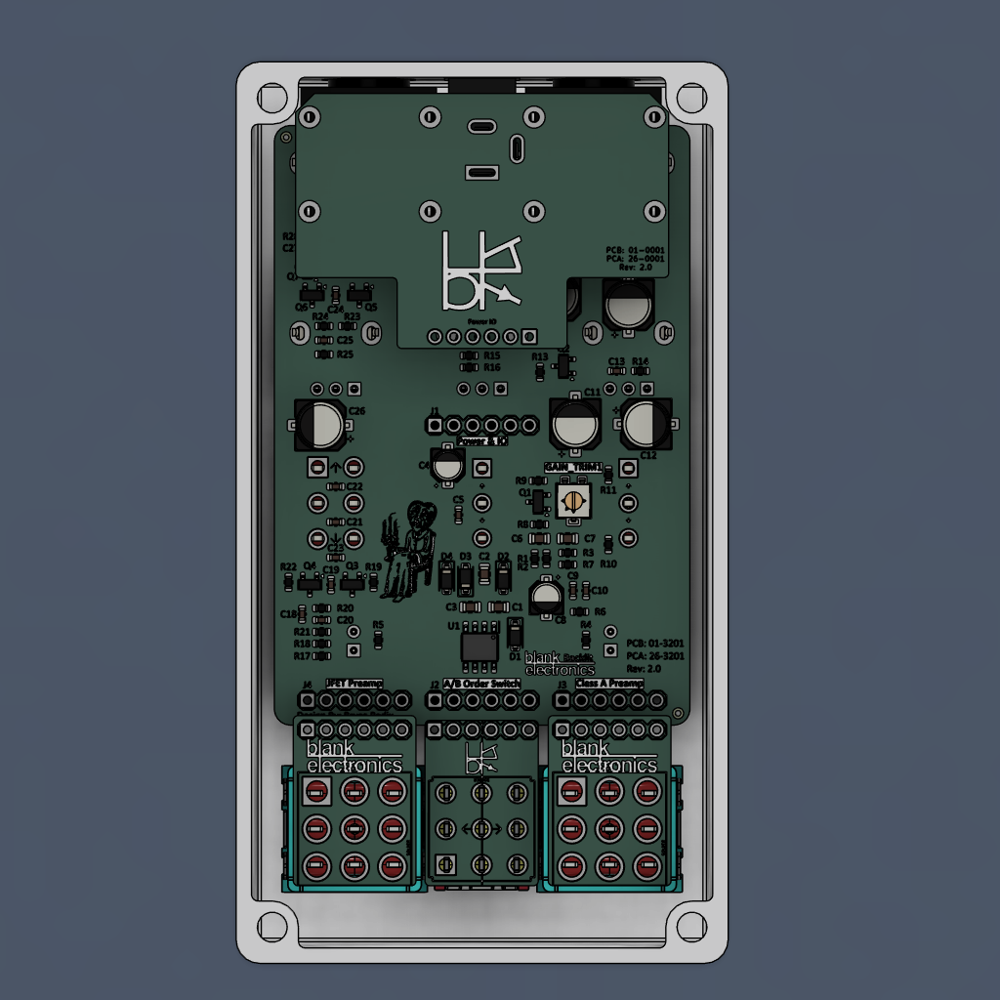
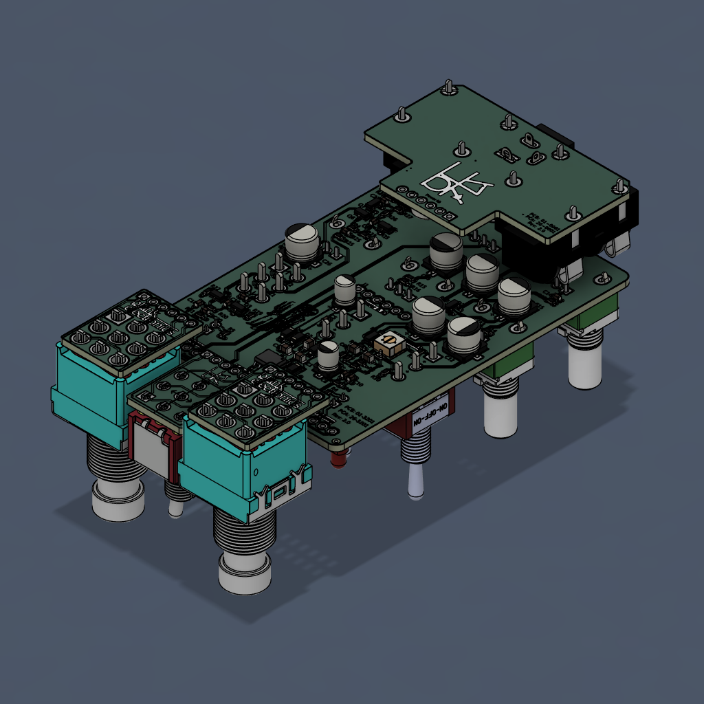
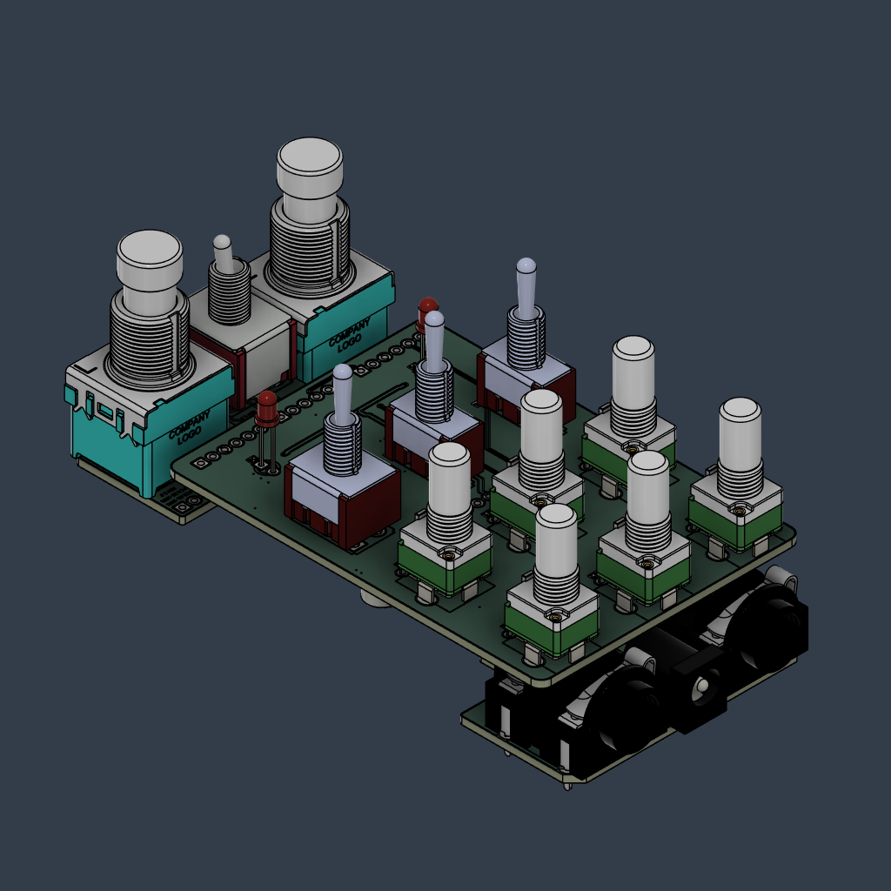
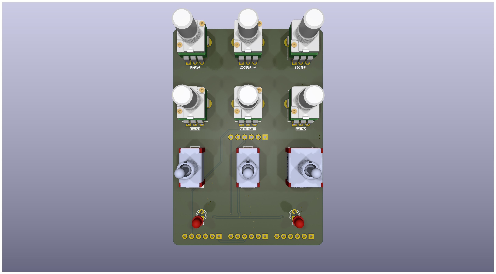
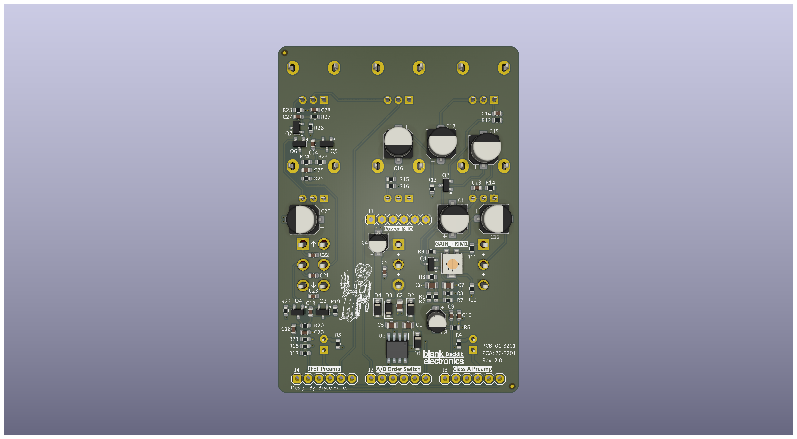
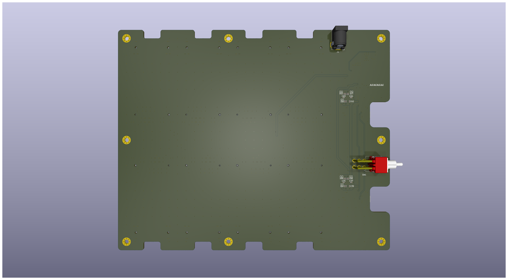
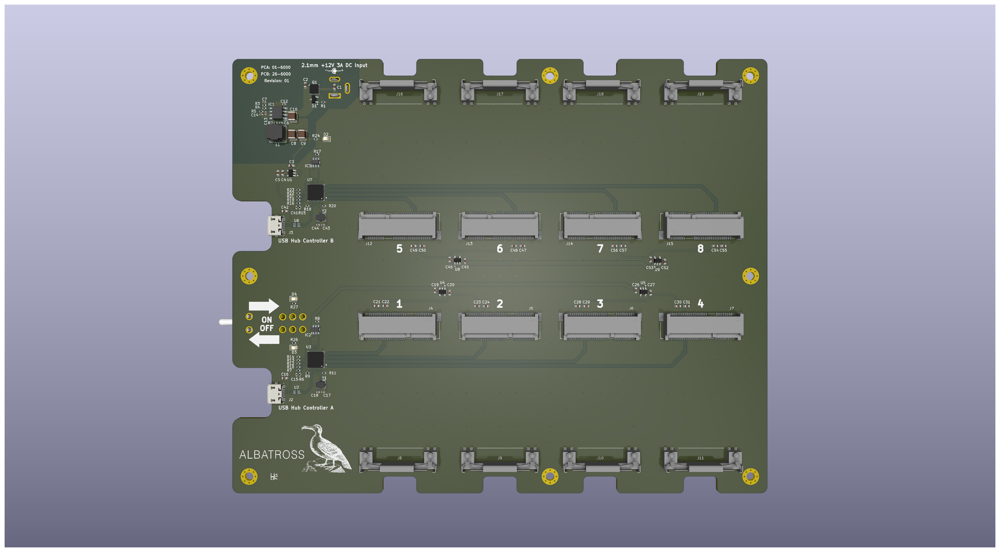
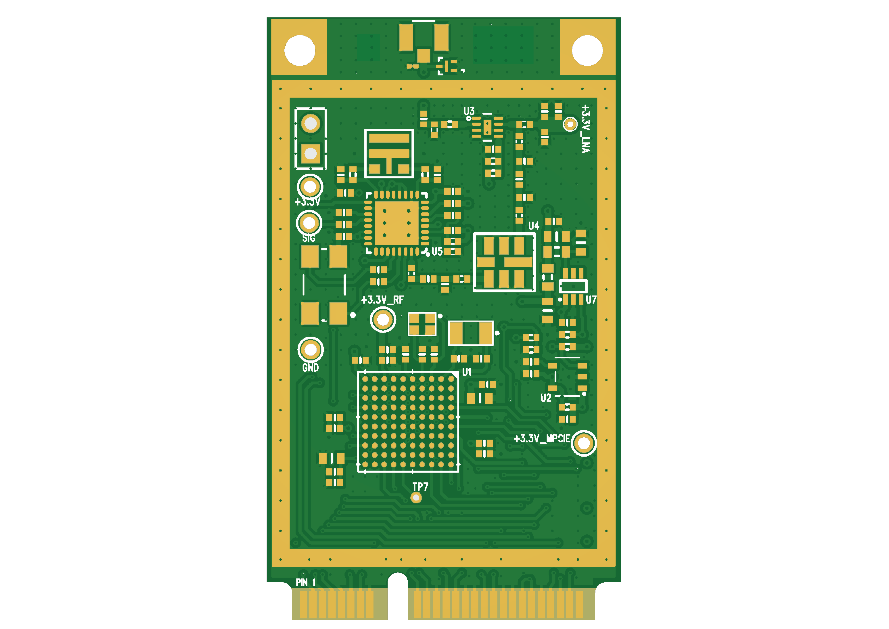

# PCB Design Portfolio
This portfolio showcases my previous work in PCB design. It includes pictures of various projects that I have designed and using KiCad.

## Overview
I am a manufacturing engineer with experience in designing PCBs mostly using KiCad. I have designed and fabricated numerous PCBs for various applications, including RF (433Mhz, 915Mhz, and 2.4Ghz), DSP, USB Hubs, PDNs, and Audio.

## Skills
My skills in PCB design include:

- Designing and routing PCBs using KiCad, Eagle CAD, Allegro, and Altium.
- Knowledge of PCB layout design principles
- Creating custom footprints for components
- Generating Gerber files for fabrication
- Selecting appropriate components and connectors for specific applications
- Soldering and assembling PCBs
- Familiarity with various assembly techniques such as SMT and through-hole assembly

## Pictures
Here are pictures of my previous PCB design work:

|  |  |  |  |
| ------- | ------- | ------- | ------- |
|  |  |  |  |
|  |  |  |  | |

## Contact
If you are interested in my services for your next PCB design project, please feel free to contact me.

Email: **bredix@blankelectronics.com**
